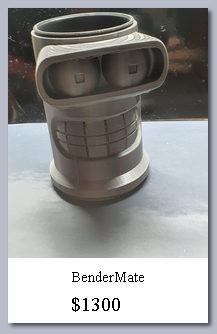
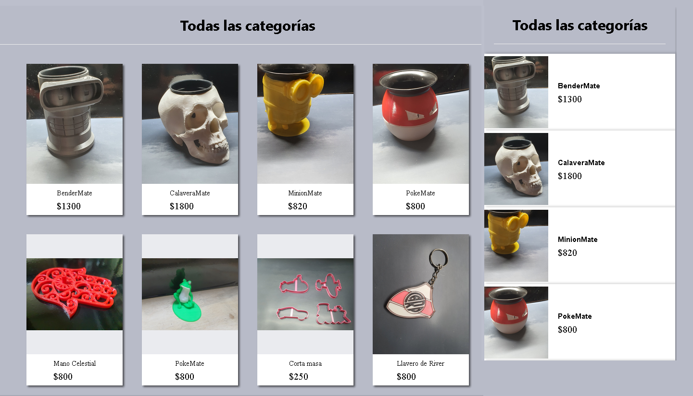
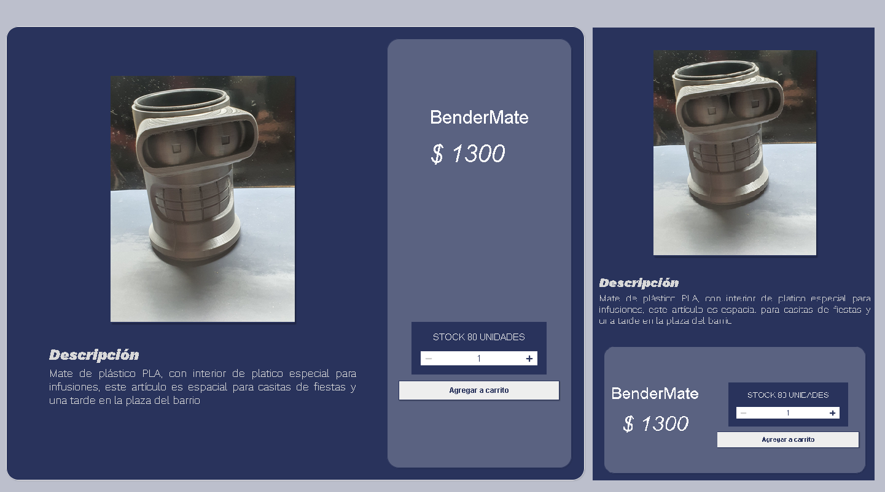
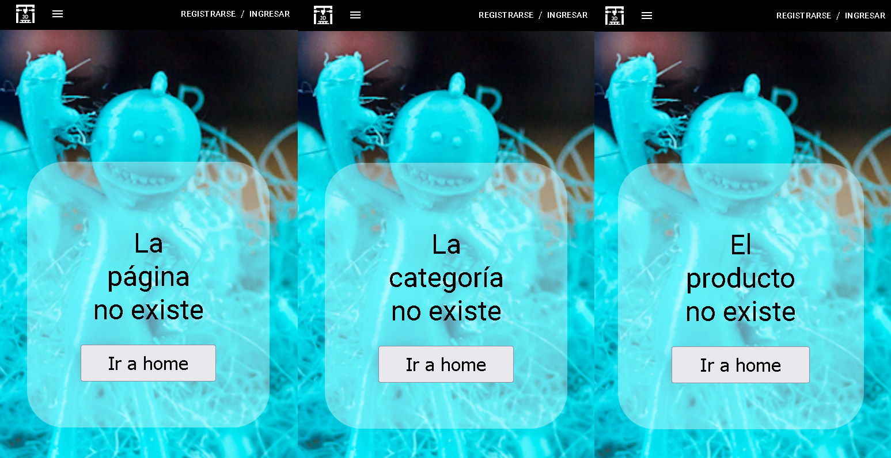

# Universo 3d

## Descripción del proyecto
__Universo 3d__ está pensado para la venta de productos desarrollados con impresoras 3d. Tiene tarjetas con los productos en la que se incluyen, la imagen del mismo, el nombre y el precio.

__Producto__

El usuario podrá filtrar el conjuto de productos mediante categorías, una vez visto el producto que se desea, el usuario podrá hacer click en el mismo para ser dirigido a una nueva pantalla, donde se encuentra la descripción del producto y un itemCounter que le permitirá seleccionar la cantidad y llevarlo a un carrito de compras.

## Descripción del diseño
Cuenta con un __Header__ en el que se incluye una barra de navegación, la misma esta constituida por una marca , categorías y un ícono de un carrito de compras y tiene dos estados, uno para páginas desktop y otro para pantallas mobile. 

__Barra Desktop__

__Barra Mobile__

__Barra Mobile Expandida__

Un __Main__,  donde se encuentra la información llamada por la barra de navegación, tales como productos y detalles de los mismos.

__Main con todas las categorías en versión desktop y luego en versión para mobile__

__Main con detalle de un producto en versión desktop y luego en versión para mobile__

## Página de error
Si el usuario ingresa una dirección no contemplada o escapa de lo establecido en el diseño, pueden darse 3 casos:
1. nombredelapagina.com/direccionNoContemplada
2. nombredelapagina.com/category/categoriaNoContemplada
3. nombredelapagina.com/item/productoNoContemplado

Para lo que aparecerán las siguientes pantallas:

__Error en versión para mobile__

## Librerías usadas
### Predeterminadas de Create React Aplication
*    react ^18.1.0
*    react-dom 18.1.0
*    react-scripts ^5.0.1
*    web-vitals ^2.1.4

### Librerías de navegación
*    [react-router-dom ^6.3.0](https://reactrouter.com/)

### Librerías para estética
*    [react-icons ^4.4.0](https://react-icons.github.io/react-icons)
  
Decidí usar esta librería, para dar una vista más profesional al proyecto, incluyendo íconos sencillos y fáciles de agregar.

